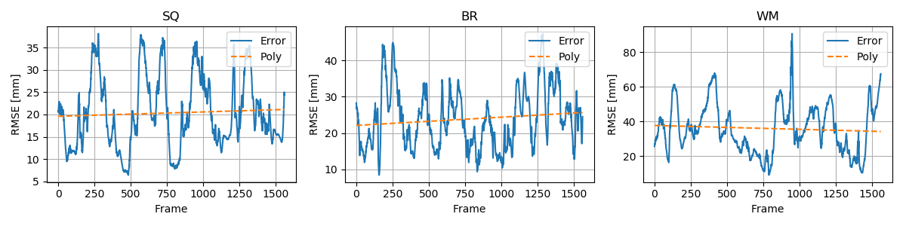

# DFM-Net

Dooyoung Kim, Junghan Kwon, Seunghyun Han, Yong-Lae Park, Sungho Jo. "Deep Full-Body Motion Network (DFM-Net) for a Soft Wearable Motion Sensing Suit", submitted to TMECH.

## Video (YouTube)

## Fabrication

### Circuit

### Sensor Placement

## QnA
### Q.1 How well the proposed approach behaves when repeating sessions of motions. How do the sensor signals drift and does it require to repeat the calibration procedure? 

The root mean sq ~ is illustrated as below. In our experiment, there are no draft effect a~ and it is a neg~ . Therefore, our method dose not need to re-calibration procedure. 

## Code usage

### Environment
* pytorch 0.3
* numpy
* scipy
* matplotlib
* scikit-learn
* quaternion [https://anaconda.org/moble/quaternion]

### Trained model and test results (used in the journal)
* result/T60_model.torch.
* result/*.mat

## Contact
dykim07@kaist.ac.kr