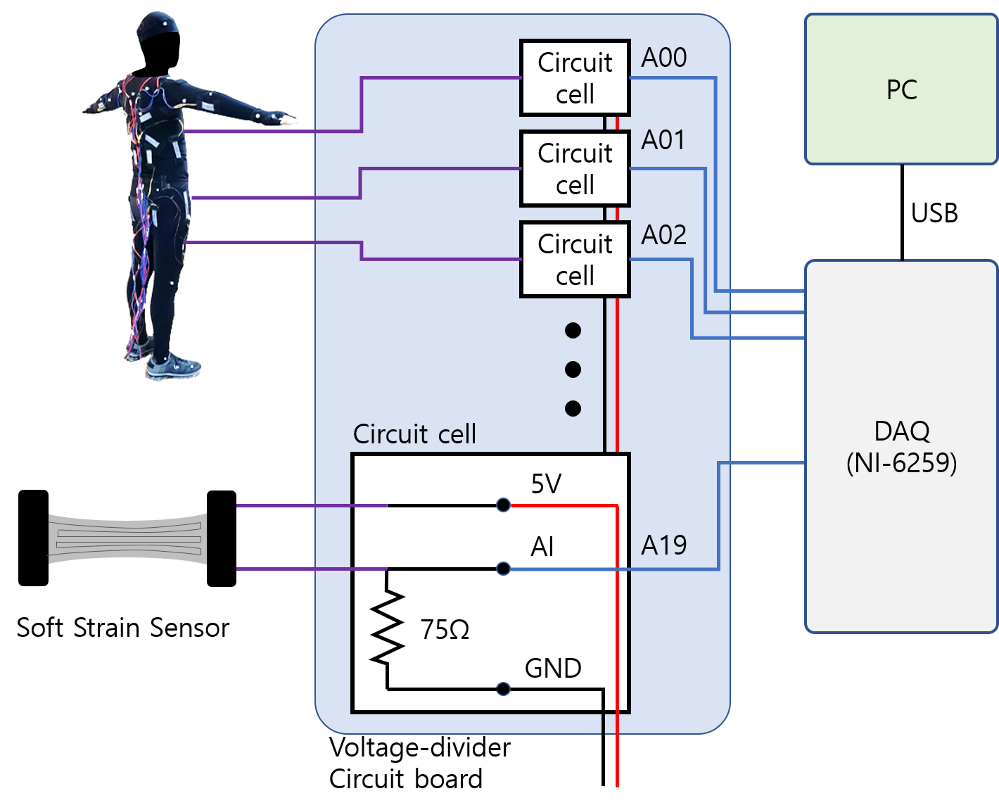
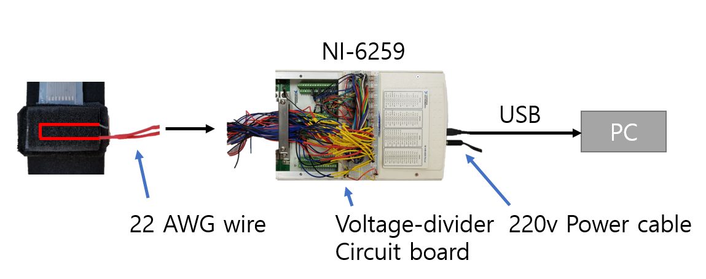

# DFM-Net

Dooyoung Kim, Junghan Kwon, Seunghyun Han, Yong-Lae Park, Sungho Jo. "Deep Full-Body Motion Network (DFM-Net) for a Soft Wearable Motion Sensing Suit", submitted to TMECH.

## Abstract
Soft sensors are becoming more popular in wearables as a means of tracking human body motions due to their high stretchability and easy wearability. However, previous research not only was limited to only certain body parts but also showed problems in both calibration and processing of the sensor signals, which are caused by the high nonlinearity and hysteresis of the soft materials and also by misplacement and displacement of the sensors during motion. Although this problem can be alleviated through redundancy by employing an increased number of sensors, it will lay another burden of heavy processing and power consumption. Moreover, complete fullbody motion tracking has not been achieved yet. Therefore, we propose use of deep learning for full-body motion sensing, which significantly increases efficiency in calibration of the soft sensor and estimation of the body motions. The sensing suit is made of stretchable fabric and contains 20 soft strain sensors distributed on both the upper and the lower extremities. Three athletic motions were tested with a human subject, and the proposed learning-based calibration and mapping method showed a higher accuracy than traditional methods that are mainly based on mathematical estimation, such as linear regression. 

**Youtube**

## Fabrication

### Data acquisition setup

* Circuit

* Connexions  

### Sensor Placement
The where and how these sensors are important issues in our research. 
We considered the complexity of joint motion, the correlation between the joint and muscles, and direction of the muscles fiber to decide the position and quantity of the soft sensors. For example, the trivial one-DOF joints such as the elbow ware measured only one soft sensor. However, the shoulder has more complex motions than the one-DOF joints, thus we attached multiple sensors around it. 
We indicate the locations of the sensors as below.

*Source of the muscle image: http://www.teachpe.com/anatomy/muscles.php*

In addition, the detail form of the fastener and its attachment result are drawn as below.

As you can be seen in that figure, the fastener tightly adheres to the suit within the stretchable limit of the soft sensor.

## release note

### v1.0 : TMECH

* bug fix

### v1.4

* pytorch 0.4 migration
* tensorboardx
* scikit-learn wrapper
* standard scaler 

## Code usage

### Environment

#### v1.0

* pytorch 0.3
* numpy
* scipy
* matplotlib
* scikit-learn
* quaternion [https://anaconda.org/moble/quaternion]

#### v1.4
* pytorch 0.4
* tensorboardx

### Trained model and test results : !! v1.0 only !!
* pre_result/pt_model.torch
* pre_result/*.mat

## Contact
dykim07@kaist.ac.kr
